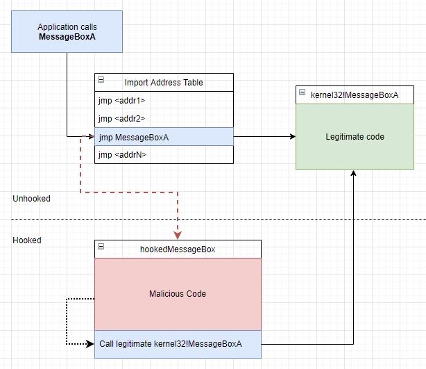

# IAT-Patcher

[//]: # (This may be the ugliest README file you have ever seen. I hate markdown.)


A simple to use Import Address Table hooking utility based on [CommonLib](https://github.com/mayossi/CommonLib/).

<p style="font-family: Arial, sans-serif; line-height: 1.6;">
    <strong>IAT (Import Address Table) hooking</strong> is a technique used to intercept function calls in a Windows application 
    by modifying the address table that an application uses to call external functions from DLLs.<br>
    By replacing the address of a function in the IAT with the address of a custom function (a "hook"), 
    you can redirect calls intended for the original function to your custom code.<br>
</p>

This diagram explains IAT hooking *(taken from [ired.team](http://ired.team/))*
<p align="center">
  
</p>

<br>

### Usage
```c++
// Our hook. This function will replace the original MessageBoxW.
int WINAPI hookedMessageBoxW(const HWND hWindow, LPCWSTR lpText, LPCWSTR lpCaption, const UINT uType);

int main()
{
    // A CommonLib hook structure.
	clib::windows::hook::Hook hook = clib::windows::hook::Hook{
		"user32.dll",
		"MessageBoxW",
		hookedMessageBoxW,
		MessageBoxW
	};

	// Installing IAT hook on MessageBoxW.
	patcher::IATPatcher patcher;
	patcher.install(hook);

	// This call will be hooked.
	MessageBoxW(NULL, L"This is some text!", L"This is some text", NULL);
	
	// Uninstalling the hook.
	patcher.uninstall(hook);

	// This call will execute normally.
	MessageBoxW(NULL, L"This is some text!", L"This is some text", NULL);

    return 0;
}

```

<br>

### Disclaimer

<p>This repository is intended for <strong>research and educational purposes only</strong>. The use of this code is <strong>entirely at your own risk</strong>.</p>

<p><strong>Responsibility:</strong> The author takes no responsibility or liability for how you choose to use the code provided here. By using, copying, or distributing any part of this repository, you acknowledge that the author takes no responsibility for any consequences resulting from your actions.</p>

<p><strong>Risk Acknowledgement:</strong> By using, copying, or distributing any part of this repository, you acknowledge that you are doing so at your own risk. You accept full responsibility for your actions.</p>

<p><strong>No Endorsement:</strong> This repository does <strong>not</strong> endorse or promote any hacking-related activity.</p>
